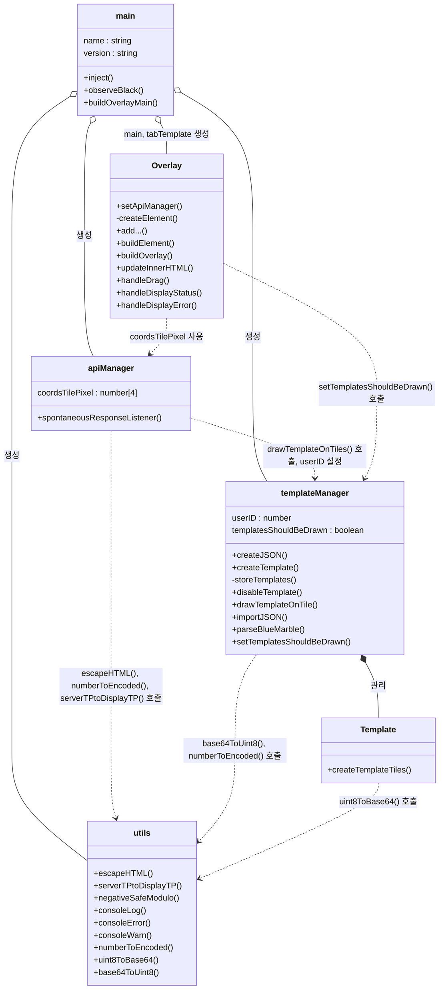
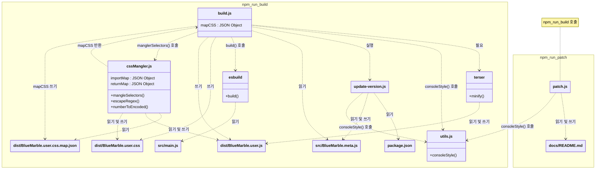

# 이 문서는 기계 번역 되었습니다!!!
<table>
  <tr>
    <td><a href="#기여하기">기여하기</a></td>
    <td valign="top" rowspan="99"></td>
  </tr>
  <tr>
    <td>&emsp;<a href="#요약">요약</a></td>
  </tr>
  <tr>
    <td>&emsp;<a href="#가이드라인을-따르는-이유">가이드라인을 따르는 이유</a></td>
  </tr>
  <tr>
    <td>&emsp;<a href="#무엇을-기여할-수-있나요">무엇을 기여할 수 있나요?</a></td>
  </tr>
  <tr>
    <td>&emsp;&emsp;<a href="#프로그래밍">프로그래밍</a></td>
  </tr>
  <tr>
    <td>&emsp;&emsp;<a href="#번역">번역</a></td>
  </tr>
  <tr>
    <td>&emsp;&emsp;<a href="#그-밖의-모든-것">그 밖의 모든 것</a></td>
  </tr>
  <tr>
    <td>&emsp;<a href="#할-수-없는-일">할 수 없는 일</a></td>
  </tr>
  <tr>
    <td>&emsp;<a href="#가이드라인">가이드라인</a></td>
  </tr>
  <tr>
    <td>&emsp;<a href="#우리의-사명">우리의 사명</a></td>
  </tr>
  <tr>
    <td>&emsp;<a href="#기여하는-방법">기여하는 방법</a></td>
  </tr>
  <tr>
    <td>&emsp;<a href="#배포-환경">배포 환경</a></td>
  </tr>
  <tr>
    <td>&emsp;&emsp;<a href="#npm-run">Npm Run</a></td>
  </tr>
  <tr>
    <td>&emsp;&emsp;<a href="#차트">차트</a></td>
  </tr>
  <tr>
    <td>&emsp;<a href="#개발-환경">개발 환경</a></td>
  </tr>
</table>

<h1>기여하기</h1>

  유저스크립트 "블루 마블"에 기여해 주셔서 감사합니다! 프로젝트를 좋아해 주시고 성장에 도움을 주고 싶어 하신다는 사실이 저에게 큰 의미가 됩니다. 아직 참여하지 않으셨다면 디스코드에 가입해 보세요. 그곳에서 유저스크립트에 관해 질문하고 피드백을 받을 수 있습니다. 더 많은 정보는 <a href="https://bluemarble.lol/" target="_blank" rel="noopener noreferrer">공식 블루 마블 웹사이트</a>에서도 확인할 수 있습니다.
   
  <b>참고</b>: AI를 사용하며 코드베이스 파일 간의 관계를 AI에게 알려주고 싶다면, 이 파일의 차트 섹션에 있는 <code>블루 마블 관계 클래스 다이어그램</code>을 여세요. 다이어그램을 복사하여 AI에게 전달하면 됩니다.
   
  <b>참고</b>: 이 프로젝트의 문서에 기여한다면 <code>documentation</code> 브랜치에서 포크를 만드세요. 코드나 프로그래밍에 기여한다면 <code>code</code> 브랜치에서 포크를 만드세요. <code>main</code>을 포크하여 <code>main</code> -> <code>main</code>으로 PR을 만들면 거부될 수 있습니다. <code>main</code>은 최신 상태가 아니므로, 변경 사항이 최신 변경 사항과 충돌할 수 있기 때문입니다.

<h2>요약</h2>

  <ul>
    <li>여러분의 시간을 낭비하고 싶지 않으니, 새 기능 추가처럼 큰 변경을 시작하기 전에 저와 먼저 상의해 주세요. 예를 들어 픽셀을 자동으로 배치하는 봇을 만드는 데 50시간을 썼는데, 픽셀 자동 배치 봇이 블루 마블의 "사명"에 맞지 않아 풀 리퀘스트가 거부된다면 정말 슬픈 일일 것입니다. :(</li>
    <li>프로젝트의 스타일을 따르세요. 예를 들어 모든 오버레이가 <code>Overlay()</code> 호출로 만들어져 있다면, 새 오버레이도 <code>Overlay()</code>를 호출하는 것이 좋습니다.</li>
    <li>품질이 낮은 코드는 거부됩니다.</li>
    <li>블루 마블 문서는 <a href="https://swingthevine.github.io/Wplace-BlueMarble/index.html" target="_blank" rel="noopener noreferrer">여기</a>에서 확인할 수 있습니다.</li>
    <li><code>main</code> 브랜치를 포크하지 마세요! <code>code</code> 또는 <code>documentation</code>을 포크하세요.</li>
    <li>새 기능을 함수 안에 넣는 것이 가능하다면 함수를 사용하세요. 그러면 다른 사람의 코드와 충돌할 가능성이 줄어듭니다. 코드를 <a href="https://en.wikipedia.org/wiki/Modular_programming" target="_blank" rel="noopener noreferrer">모듈화</a>하세요.</li>
  </ul>

<h2>가이드라인을 따르는 이유</h2>

  이 페이지의 가이드라인을 따르면 모두에게 도움이 됩니다. 가이드라인을 따르는 코드는 다음과 같은 효과가 있습니다.
  <ul>
    <li>제가 여러분의 기능을 구현하고 계속 지원하는 데 도움이 됩니다.</li>
    <li>여러분의 기능이 구현됩니다.</li>
    <li>다른 사람들도 새롭게 지원되는 기능을 사용할 수 있습니다.</li>
  </ul>
  모두에게 좋은 결과입니다!

<h2>무엇을 기여할 수 있나요?</h2>
<h3>프로그래밍</h3>
  

    이 유저스크립트에서 해야 할 일 대부분은 프로그래밍과 관련되어 있습니다. 프로그래밍 경험이 있으면 도움이 되지만 필수는 아닙니다. JavaScript와 문법을 배우고 싶다면 이 <a href="https://roadmap.sh/javascript" target="_blank" rel="noopener noreferrer">JavaScript 학습 로드맵</a>을 확인해 보세요. 완전히 새로운 기능을 구현할 계획이라면 함수, 메서드, 클래스 및 객체 지향 프로그래밍을 이해하는 것을 강력히 권장합니다. 메서드 체이닝이나 람다 표현식 같은 더 전문적인 지식도 유용하지만 필수는 아닙니다. 블루 마블 문서는 <a href="https://swingthevine.github.io/Wplace-BlueMarble/index.html" target="_blank" rel="noopener noreferrer">여기</a>에서 확인할 수 있습니다. 가능하면 코드를 모듈화하세요. 다시 말해, 가능한 경우 코드를 함수 안에 넣어 "블랙박스화"해야 합니다. 예를 들어 템플릿에 표시되지 않도록 색상을 제거하는 색상 필터를 추가한다면, 함수가 템플릿 정보와 타일 정보를 입력받아 필터링된 템플릿 및 타일 정보를 출력하도록 해야 합니다. 이렇게 하면 다른 사람의 코드가 색상 필터에 간섭할 수 없습니다. 예시는 다음과 같습니다.
     
    <ol>
      <li>템플릿 이미지가 생성되고 타일 정보를 가져옵니다.</li>
      <li>색상 필터 함수에 템플릿 이미지와 타일 정보를 전달합니다. 색상 필터는 필터링된 색상으로 템플릿 이미지를 덮어쓰고, 그 결과를 템플릿 이미지로 출력합니다.</li>
      <li>픽셀 카운터 함수에 수정된 템플릿 이미지와 타일 정보를 전달하고, 픽셀 수를 출력합니다.</li>
      <li>수정된 템플릿 이미지와 타일 정보를 사용하여 템플릿을 렌더링합니다.</li>
    </ol>
  

<h3>번역</h3>

  번역은 흔히 간과되지만 프로젝트에 기여하는 강력한 방법입니다. 글을 쓸 수 있다면 누구나 기여할 수 있습니다! 사소한 문법 오류 수정부터 언어 전체 번역까지 모든 도움을 감사히 받습니다.

<h3>그 밖의 모든 것</h3>
  

    유저스크립트는 코딩을 중심으로 하지만 기여할 방법은 다양합니다! README 파일 개선부터 튜토리얼 제작까지, 프로그래밍 기술이 필요하지 않은 방법도 많습니다. 예를 들어 기능 아이디어가 있지만 직접 구현할 능력이 없다면 기능 요청을 제출해 보세요! 누군가 아이디어를 보고 마음에 들어 직접 구현할 수도 있습니다.
  

<h2>할 수 없는 일</h2>

  지원 질문(예: "어떻게 설치하나요?" 또는 "<code>cssMangler</code>는 무엇을 하나요?")을 위해 <a href="https://github.com/SwingTheVine/Wplace-BlueMarble-Userscripts/issues" target="_blank" rel="noopener noreferrer">GitHub Issues</a>를 사용하지 마세요. GitHub 이슈 트래커는 버그 보고와 기능 요청에 사용합니다. 문제가 있어 도움이 필요하다면 <a href="https://discord.gg/tpeBPy46hf" target="_blank" rel="noopener noreferrer">디스코드</a>에서 질문하세요. <b>단, 기여를 시작하기 전에 이슈 트래커에 기능 요청을 먼저 제출해야 합니다.</b> 열심히 만든 고품질 기여가 프로젝트의 사명에 맞지 않는다는 이유로 거부되는 것만큼 안타까운 일은 없습니다. 먼저 물어보세요!

  선의로 기여해 주세요. 잘못된 코드나 주석이 포함된 풀 리퀘스트, 또는 모드에 피해를 주는 풀 리퀘스트는 거부합니다.

<h2>가이드라인</h2>
<ul>
  <li>기여를 시작하기 <i>전에</i> 항상 <a href="https://github.com/SwingTheVine/Wplace-BlueMarble-Userscripts/issues/new/choose" target="_blank" rel="noopener noreferrer">기능 요청</a>을 제출하고 작업 허가를 받으세요. 기여가 거부될 경우 시간을 절약할 수 있습니다. 철자 오류 수정 같은 작은 기여에는 기능 요청이 필요하지 않습니다.</li>
  <li><a href="https://github.com/SwingTheVine/.github/blob/main/CODE_OF_CONDUCT.md" target="_blank" rel="noopener noreferrer">행동 강령</a>을 따르세요. 여기에는 기여 내용과 커뮤니티에서 소통하는 방식이 모두 포함됩니다.</li>
  <li>변경 사항을 설명하는 명확한 메시지를 작성하세요. "몇 가지를 추가했습니다"로는 무엇이 변경되었는지 설명할 수 <i>없습니다</i>.</li>
  <li>기능이 다르면 풀 리퀘스트도 분리하세요. 템플릿과 현지화(i18n)를 하나의 풀 리퀘스트로 제출했는데 현지화를 거부하게 되면, 같은 풀 리퀘스트에 포함되어 있다는 이유로 템플릿 코드도 함께 거부됩니다. 서로 다른 기능이므로 별도의 풀 리퀘스트로 제출해야 합니다.</li>
  <li>파일 구조를 유지해야 합니다(변경 허가를 받은 경우는 제외). 예를 들어 모든 코드는 `src/`에 넣고 오버레이에 영향을 주는 코드는 Overlay 클래스 파일에 넣어야 합니다.</li>
  <li>이름 지정 규칙을 유지해야 합니다(변경 허가를 받은 경우는 제외). 예를 들어 템플릿 이미지 변수는 "templateDataImage"라고 이름 지을 수 있습니다. 대부분의 이름은 공통된 대상을 먼저 기준으로 묶어 짓습니다. 앞의 예에서 변수는 먼저 "template"와 관련되고, 그다음 "image"인 "data"와 관련됩니다. 템플릿의 데이터에서 가져온 이미지를 저장하는 변수이기 때문입니다. 이렇게 이름을 짓는 주된 이유는 무언가의 이름을 찾기 쉽게 하기 위해서입니다. "템플릿의 이미지가 필요하니 변수는 아마 'template'으로 시작하겠군."이라고 생각할 수 있습니다.</li>
  <li>코드가 무엇을 하는지 설명하는 주석을 작성해야 합니다. 코드의 동작을 이해할 수 없으면 풀 리퀘스트를 거부할 수 있습니다.</li>
</ul>

<h2>우리의 사명</h2>

  우리의 "사명"은 이 유저스크립트의 본질입니다. 사명이 없었다면 이 프로젝트도 존재하지 않았을 것입니다.

  이 유저스크립트의 사명은 문서가 잘 갖춰진 고품질 오픈 소스 템플릿 오버레이를 제공하는 것입니다.

  <ul>
    <li>대부분의 픽셀 캔버스 오버레이에는 고품질 오픈 소스 코드가 없다는 점을 알고 있습니다. 오버레이가 고품질이면 소스가 공개되지 않았거나, 소스가 공개되어 있으면 품질이 낮습니다. 이 유저스크립트는 그 문제를 해결하고자 합니다.</li>
    <li>대부분의 픽셀 캔버스 오버레이 유저스크립트가 난독화되어 있다는 점을 알고 있습니다. 수정할 수는 있지만 불필요하게 어렵습니다. 이 유저스크립트는 난독화하지 않음으로써 이러한 관행을 바꾸고자 합니다.</li>
    <li>대부분의 픽셀 캔버스 오버레이 유저스크립트에는 커뮤니티가 오버레이의 내부 동작을 수정하거나 이해할 수 있을 만큼 충분한 문서가 없다는 점을 알고 있습니다. 이 유저스크립트는 가능한 한 초보자에게 친화적으로 만들고자 합니다.</li>
  </ul>

<h2>기여하는 방법</h2>

  <ol>
    <li>모든 <a href="https://github.com/SwingTheVine/Wplace-BlueMarble/blob/main/docs/CONTRIBUTING.md" target="_blank" rel="noopener noreferrer">기여 가이드라인</a>을 읽으세요.</li>
    <li>기여하고 싶다면 <a href="https://github.com/SwingTheVine/Wplace-BlueMarble/issues/new/choose" target="_blank" rel="noopener noreferrer">여기</a>에 요청을 제출하세요.</li>
    <li>기여 작업을 시작할 허가를 받았다면 기기에 개발 환경을 설정하세요.</li>
    <li>프로젝트를 포크하세요.</li>
    <li>개발 환경에 포크를 다운로드하세요.</li>
    <li>가능하다면 유저스크립트에 이미 있는 기능 중 기여하려는 기능과 비슷한 기능의 작동 방식을 알아보면 좋습니다. 예를 들어 새 팝업 창을 추가하려면 <code>Overlay</code> 팝업 창의 작동 방식을 살펴보는 것이 도움이 될 수 있습니다.</li>
    <li>기여 내용을 작성하세요.</li>
    <li>포크에 커밋하세요.</li>
    <li>포크와 이 프로젝트 사이에 풀 리퀘스트를 제출하세요.</li>
  </ol>

<h2>배포 환경</h2>

  이곳에는 블루 마블을 수정하려는 사람에게 도움이 될 수 있는 정보가 있습니다.

  <h3>Npm Run</h3>
  

    <code>npm run build</code>를 실행하면 블루 마블이 컴파일됩니다. 컴파일된 파일은 <code>dist/</code> 디렉터리에서 찾을 수 있습니다. <code>npm run patch</code>를 실행하면 패치 버전이 증가하고 블루 마블이 컴파일됩니다.
  

  <h3>차트</h3>
  

    화살표와 확대/축소 버튼으로 차트를 탐색하세요. ↔️ 버튼을 사용하면 전체 화면으로 전환할 수 있습니다. 🔄 버튼을 사용하면 초기화할 수 있습니다. 모든 버튼은 차트에서 찾을 수 있습니다. "두 개의 사각형" 아이콘으로 차트를 복사하세요. 차트를 읽는 데 도움이 필요하다면 차트의 "두 개의 사각형" 버튼으로 차트를 복사하여 AI에 입력하세요.
  

<!-- https://mermaid.js.org/syntax/classDiagram.html -->

블루 마블 관계 클래스 다이어그램:
(마지막 업데이트: 0.74.0)

블루 마블 컴파일러/빌더 관계 클래스 다이어그램:
(마지막 업데이트: 0.74.0)

<h2>개발 환경</h2>

  다음은 SwingTheVine이 블루 마블을 개발할 때 사용하는 환경입니다. 반드시 똑같은 환경을 사용할 필요는 없으며 참고용으로 제공됩니다.

  <h3>IDE</h3>
  Visual Studio Code 
  <code>버전: 1.102.3</code> 

  <h3>브라우저</h3>
  Google Chrome 
  버전: <code>138.0.7204.184 (Official Build) (64-bit)</code> 
  TamperMonkey 버전: <code>5.3.3</code>

  <h3>운영 체제</h3>
  Windows 10 Home 
  버전: <code>22H2</code> 
  OS 빌드:	<code>19045.6093</code> 
  프로세서: <code>Intel Core i7-9750H CPU @ 2.60GHz</code> 
  RAM: <code>16.0 GB</code> 
  저장 장치: <code>932 GB SSD Samsung SSD 970 EVO Plus 1TB, 238 GB SSD HFM256GDJTNG-8310A</code> 
  그래픽 카드: <code>NVIDIA GeForce GTX 1660 Ti (6 GB)</code> 
  시스템 유형: <code>64비트 운영 체제</code>

