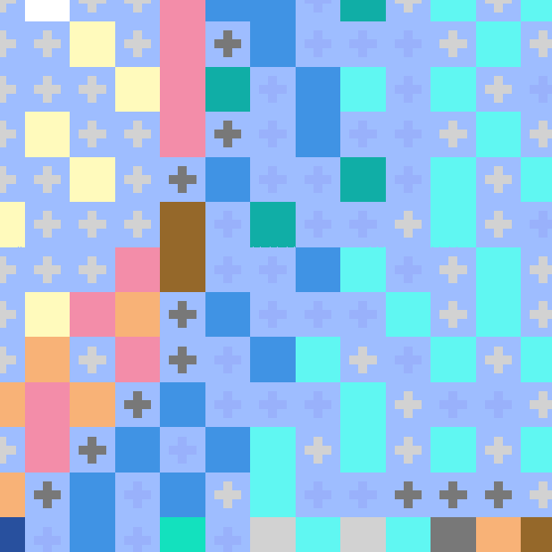
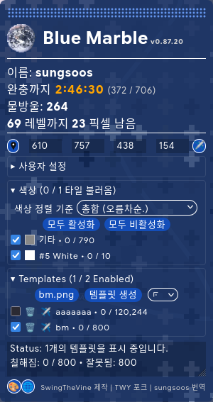
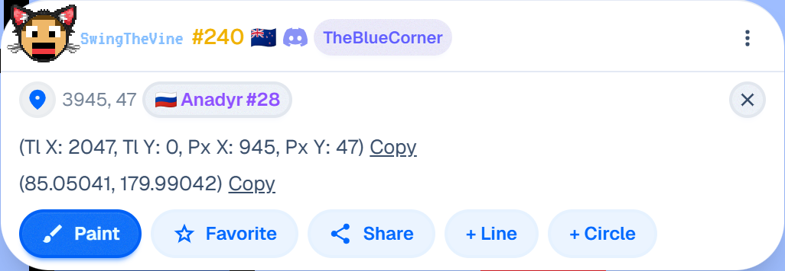
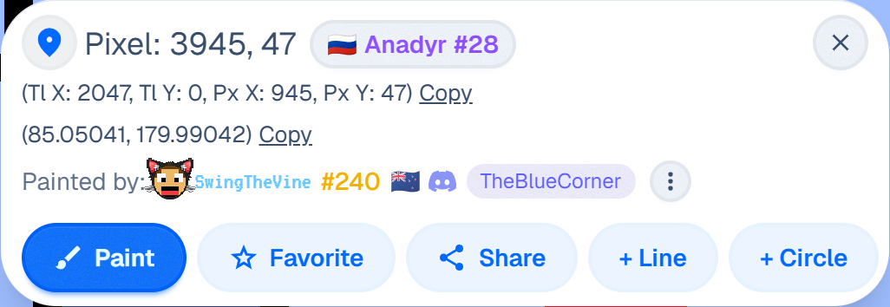
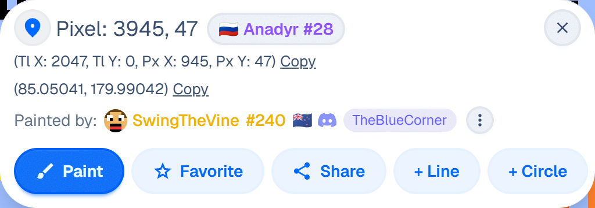
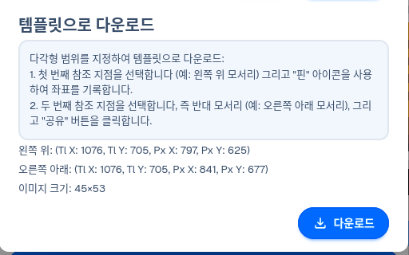
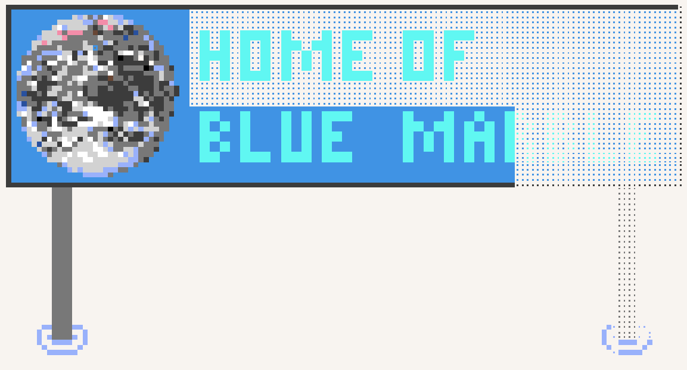

이 포크의 미리보기 이미지:

| 템플릿 | 창 |
|-|-|
|  |  |

| 픽셀 정보 | 지도 내보내기 (공유 창에서) |
|-|-|
|Wplace 1.1.1 ~ 지금:  Wplace 1.1.0:  Wplace 1.0.0:  | 

**[여기에](#regarding-this-fork)** 이 포크에 대한 정보가 더 있습니다.

<strong>원클릭 설치:</strong> 이 링크를 눌러 바로 블루 마블을 설치하세요: <a href="https://raw.githubusercontent.com/sungsoos/Wplace-BlueMarble-Userscripts-kr/custom-improve/dist/BlueMarble.user.js" target="_blank" rel="noopener noreferrer"><strong>블루 마블 설치하기</strong></a>

**[북마크 버전](/dist/BlueMarble.bookmarklet.min.js)** 도 사용 가능합니다.
사용하려면, 내용을 복사한 뒤 북마크를 만들 때 링크 입력란에 붙여넣으세요.

<table>
  <tr>
    <td><a href="#블루-마블">블루 마블</a></td>
    <td valign="top" rowspan="99"></td>
  </tr>
  <tr>
    <td>&emsp;<a href="#이-포크에-대하여">이 포크에 대하여</a></td>
  </tr>
  <tr>
    <td>&emsp;<a href="#빠른-가이드">빠른 가이드</a></td>
  </tr>
  <tr>
    <td>&emsp;<a href="#개요">개요</a></td>
  </tr>
  <tr>
    <td>&emsp;&emsp;<a href="#설치-가이드">설치 가이드</a></td>
  </tr>
  <tr>
    <td>&emsp;&emsp;<a href="#스크립트-설정">스크립트 설정</a></td>
  </tr>
  <tr>
    <td>&emsp;&emsp;<a href="#템플릿-가이드">템플릿 설정</a></td>
  </tr>
  <tr>
    <td>&emsp;<a href="#버전-관리-방식">버전 관리 방식</a></td>
  </tr>
  <tr>
    <td>&emsp;<a href="#라이선스">라이선스</a></td>
  </tr>
  <tr>
    <td>&emsp;<a href="#자주-묻는-질문">자주 묻는 질문</a></td>
  </tr>
  <tr>
    <td>&emsp;&emsp;<a href="#블루-마블은-악성코드인가요">블루 마블은 악성코드인가요?</a></td>
  </tr>
  <tr>
    <td>&emsp;&emsp;<a href="#블루-마블이-알아서-픽셀을-찍어줄-수-있나요">블루 마블이 알아서 픽셀을 찍어줄 수 있나요?</a></td>
  </tr>
  <tr>
    <td>&emsp;&emsp;<a href="#창을-어떻게-숨기나요">창을 어떻게 숨기나요?</a></td>
  </tr>
  <tr>
    <td>&emsp;&emsp;<a href="#왜-게임-알림이-창보다-위에-표시되나요">왜 게임 알림이 창보다 위에 표시되나요?</a></td>
  </tr>
</table>

<h1>블루 마블</h1>

<h2>이 포크에 대하여</h2>

  

    다른 브라우저 플랫폼과 달리 앱스토어에서 유료 앱인 TamperMonkey 앱을 구매하고 
    싶지 않은 분들은, Userscripts 앱이 괜찮은 유저스크립트 관리자가 될 수 있습니다.
  

  

    그러나 Userscripts가 지원하는 GM API는 Tampermonkey가 지원하는 범위보다 훨씬 적습니다. 
    특히 블루 마블이 사용하는 기존 동기 API들은 Greasemonkey 4.0 이상 버전에서 삭제되어 다른 대안으로 교체되어야 합니다.
  

  <ul>
    <li>GM_addStyle → GM.addStyle</li>
    <li>GM_getValue → GM.getValue</li>
    <li>GM_getResourceText → 바뀜 (GM.getResourceText가 더이상 없음)</li>
  </ul>

  ... 번역이 되지 않은 변경사항을 보시려면 [여기를](https://github.com/sungsoos/Wplace-BlueMarble-Userscripts-kr#regarding-this-fork) 클릭해 주세요

<h2>빠른 가이드</h2>

  원하는 항목을 클릭하세요.
  

    

      <b>블루 마블을 다운로드하고 싶어요.</b> (눌러서 펼치기)
    

    <a href="#설치-가이드">여기를 눌러</a> 설치 방법을 보세요.
  

  

    

      <b>블루 마블에 대한 질문을 하고 싶어요.</b> (눌러서 펼치기)
    

    <a href="https://discord.gg/tpeBPy46hf" target="_blank" rel="noopener noreferrer">여기를 눌러</a> 블루 마블 지원 디스코드 서버 초대를 받으세요. (영어를 써주세요)
     
    <a href="https://github.com/sungsoos/Wplace-BlueMarble-Userscripts-kr/discussions/categories/q-a">여기를 눌러</a> 도움 및 질문 페이지를 여세요. (여전히 영어에요)
  

  

    

      <b>오류를 신고하고 싶어요.</b> (눌러서 펼치기)
    

    <a href="https://github.com/sungsoos/Wplace-BlueMarble-Userscripts-kr/issues/new/choose">여기를 눌러</a> 이슈 만들기 창을 열고, "Bug Report"를 선택하세요. (영어를 써주세요)
  

  

    

      <b>기능을 제안하고 싶어요.</b> (눌러서 펼치기)
    

    <a href="https://github.com/sungsoos/Wplace-BlueMarble-Userscripts-kr/issues/new/choose">여기를 눌러</a> 이슈 만들기 창을 열고, "Feature Request"를 선택하세요. (영어를 써주세요)
  

  

    

      <b>이 프로젝트에 기여하고 싶어요.</b> (눌러서 펼치기)
    

    <a href="https://github.com/sungsoos/Wplace-BlueMarble-Userscripts-kr/blob/custom-improve/docs/CONTRIBUTING.md">여기를 눌러</a> 기여 가이드를 읽으세요.
  

  

    

      <b>취약점을 신고하고 싶어요.</b> (눌러서 펼치기)
    

    <a href="https://github.com/sungsoos/Wplace-BlueMarble-Userscripts-kr/security">여기를 눌러</a> 취약점 신고를 해주세요. (영어를 써주세요)
  

  

    

      <b>웹사이트를 방문하고 싶어요.</b> (눌러서 펼치기)
    

    <a href="https://bluemarble.lol/" target="_blank" rel="noopener noreferrer">여기를 눌러</a> 공식 블루 마블 사이트를 방문하세요. (영어에요)
  

<h2>개요</h2>

  블루 마블에 오신 것을 환영합니다! 블루 마블은 <a href="https://wplace.live/" target="_blank" rel="noopener noreferrer">wplace.live</a>를 위한 유저스크립트입니다. 블루 마블의 용도는 이미지를 만들고, 캔버스에 씌우기 위해서입니다! 그러면, 당신의 그림을 여러 탭/모니터를 번갈아 보지 않고 확인할 수 있습니다. 추가로, 블루 마블은 멋진 추가 기능을 지원합니다. 예시를 들어:  
  <ul>
    <li>레벨업을 하는데 필요한 픽셀 수 표시</li>
    <li>간단한 좌표 시스템 표시 (타일 위치 및 픽셀 위치)</li>
    <li>픽셀을 배치할 때, 색상 팔레트를 위로 옮기기</li>
    <li>템플릿 사진에 색상 선택기를 사용하여 올바른 색상 사용하기</li>
    <li>...그리고 더!</li>
  </ul>
  이 유저스크립트가 좋다면, 리포지토리에 ⭐을 남겨주세요! 더 많은 정보를 원하면, <a href="https://bluemarble.lol/" target="_blank" rel="noopener noreferrer">블루 마블 웹사이트</a>를 방문하세요. 블루 마블에 기여하고 싶으면, <code>docs/</code>에 있는 <a href="https://github.com/sungsoos/Wplace-BlueMarble-Userscripts-kr/blob/custom-improve/docs/CONTRIBUTING.md" target="_blank" rel="noopener noreferrer">CONTRIBUTING.md</a>를 확인해 주세요.

  

  <h3>설치 가이드</h3>
  
  
  

    블루 마블은 모바일 기기에서 작동합니다. 블루 마블은 크롬을 위해 제작되었지만, 
    위에 없는 "지원되지 않는" 브라우저에서도 작동할 수 있습니다. 특정 파이어폭스 버전/포크에서 작동합니다. 특정 파이어폭스 버전/포크에서는 작동하지 않습니다.
     
    블루 마블 설치 가이드는 아래에 적혀 있습니다. 화살표를 눌러 가이드를 확장하세요. 파란 글씨는 링크입니다.
    

      

        <b>크롬에 설치</b> (눌러서 펼치기)
      

      
      <ol>
        <li>Chrome용 <a href="https://chromewebstore.google.com/detail/tampermonkey/dhdgffkkebhmkfjojejmpbldmpobfkfo" target="_blank" rel="noopener noreferrer">TamperMonkey</a> 확장 프로그램을 설치하세요.
         
        </li>
        <li>확장 프로그램을 마우스 오른쪽 버튼으로 클릭하세요.
         
        </li>
        <li>'확장 프로그램 관리'를 마우스 왼쪽 버튼으로 클릭하세요.</li>
        <li>'개발자 모드'를 활성화하세요.
         
        </li>
        <li>'사용자 스크립트 허용'을 활성화하세요.</li>
        <li><strong>원클릭 설치:</strong> 이 링크를 눌러 블루 마블을 바로 설치하세요: <a href="https://raw.githubusercontent.com/sungsoos/Wplace-BlueMarble-Userscripts-kr/custom-improve/dist/BlueMarble.user.js" target="_blank" rel="noopener noreferrer"><strong>블루 마블 설치</strong></a>
         
        TamperMonkey가 유저스크립트를 자동으로 감지하고 설치 여부를 묻습니다.</li>
        <li><a href="https://wplace.live/" target="_blank" rel="noopener noreferrer">wplace.live</a> 웹페이지를 새로고침하세요.</li>
      </ol>
    

    

      

        <b>Microsoft Edge에 설치</b> (눌러서 펼치기)
      

      <ol>
        <li>Microsoft Edge용 <a href="https://microsoftedge.microsoft.com/addons/detail/iikmkjmpaadaobahmlepeloendndfphd" target="_blank" rel="noopener noreferrer">TamperMonkey</a> 플러그인을 설치하세요.
         
        </li>
        <li>확장 프로그램을 마우스 오른쪽 버튼으로 클릭하세요.
         
        </li>
        <li>'확장 프로그램 관리'를 마우스 왼쪽 버튼으로 클릭하세요.</li>
        <li>'개발자 모드'를 활성화하세요.
         
        </li>
        <li><a href="https://raw.githubusercontent.com/sungsoos/Wplace-BlueMarble-Userscripts-kr/custom-improve/dist/BlueMarble.user.js" target="_blank" rel="noopener noreferrer">BlueMarble.user.js</a> 파일을 다운로드하세요.</li>
        <li>TamperMonkey 대시보드를 여세요.
         
        </li>
        <li><code>BlueMarble.user.js</code> 파일을 TamperMonkey 대시보드 안으로 끌어다 놓으세요.
         
        </li>
        <li>'설치' 버튼을 클릭하여 블루 마블을 설치하세요.
         
        </li>
        <li>TamperMonkey 대시보드에서 블루 마블을 활성화하세요.
         
        </li>
        <li><a href="https://wplace.live/" target="_blank" rel="noopener noreferrer">wplace.live</a> 웹페이지를 새로고침하세요.</li>
      </ol>
    

    

      

        <b>파이어폭스에 설치하기</b> (눌러서 펼치기)
      

      <ol>
        <li><a href="https://addons.mozilla.org/en-US/firefox/addon/tampermonkey/" target="_blank" rel="noopener noreferrer">TamperMonkey</a> 플러그인을 설치하세요.
         
        </li>
        <li><strong>원클릭 설치:</strong> 이 링크를 눌러 블루 마블을 설치하세요: <a href="https://raw.githubusercontent.com/sungsoos/Wplace-BlueMarble-Userscripts-kr/custom-improve/dist/BlueMarble.user.js" target="_blank" rel="noopener noreferrer"><strong>블루 마블 설치</strong></a>
         
        TamperMonkey가 유저스크립트를 자동으로 감지하고 설치 여부를 묻습니다.</li>
        <li><a href="https://wplace.live/" target="_blank" rel="noopener noreferrer">wplace.live</a> 웹페이지를 새로고침하세요.</li>
      </ol>
    

    

      

        <b>TamperMonkey 대신 사파리에 Userscripts 사용하기</b> (눌러서 펼치기)
      

      <ol>
        <li>앱 스토어에서 <a href="https://apps.apple.com/us/app/userscripts/id1463298887" target="_blank" rel="noopener noreferrer">Userscripts</a> 앱을 설치하세요.
         
        블루 마블을 위한 권한이 사파리와 앱에 부여되었는지 확인하세요.</li>
         
        <li>블루 마블 스크립트를 Userscripts에서 설정한 위치에 저장하세요: <a href="https://raw.githubusercontent.com/sungsoos/Wplace-BlueMarble-Userscripts-kr/custom-improve/dist/BlueMarble.user.js" target="_blank" rel="noopener noreferrer"><strong>블루 마블 다운로드</strong></a>
         
        Userscripts가 자동으로 유저스크립트를 감지할 것입니다.</li>
        <li><a href="https://wplace.live/" target="_blank" rel="noopener noreferrer">wplace.live</a> 웹페이지를 새로고짐 하세요.</li>
        <li>Userscripts에 대한 문제점과 사용 방법은 <a href="https://github.com/quoid/userscripts/" target="_blank" rel="noopener noreferrer"><strong>Userscripts 리포지토리</strong></a>에서 보셔야 합니다.
      </ol>
    

  

  <h3>템플릿 가이드</h3>
  

    블루 마블은 당신의 템플릿을 같은 크기로 표시할 것입니다. 만약 당신의 사진이 500x300이라면, 템플릿도 500x300이 될 것입니다. 여기는 템플릿 사진을 캔버스에 표시하기 위한 가이드입니다: 
    <ol>
      <li>왼쪽 위 코너의 좌표를 찾습니다. <code>타일 X</code>, <code>타일 Y</code>, <code>픽셀 X</code>, and <code>픽셀 Y</code> 를 좌표로 채웁니다. "핀" 아이콘을 눌러 좌표를 자동으로 채울 수 있습니다.
       
      </li>
      <li>PNG 혹은 WEBP 사진을 업로드 합니다.</li>
      <li>"만들기" 버튼을 누릅니다.</li>
      <li>템플릿이 보이지 않다면, "활성화" 버튼을 눌러보세요.</li>
    </ol>
  

  <h3>스크립트 설정</h3>
  

    블루 마블 유저스크립트에는 많은 설정이 있습니다! 이 설정들로, 스크립트가 어떻게 동작하는지 바꿀 수 있습니다.
  

  <h3>템플릿 설정</h3>
  

    <h4>투명 픽셀</h4>
    

      블루 마블을 위한 템플릿은 약간 다르게 동작합니다. "투명" 색상이 있고, 템플릿에서 투명 픽셀은 일반적으로 무시되므로, 당신의 템플릿은 "투명" 색상 픽셀을 시각화하는 색상이 필요합니다.
      <ul>
        <li>만약 특정 픽셀이 어떤 색상이 되기를 원하면, 그 픽셀은 당신의 템플릿에서 투명 색상이 되어야 합니다.</li>
        <li>만약 어떤 픽셀이 "투명" 색상이 되기를 원하면, 그 픽셀은 당신의 템플릿에서 <code>#deface</code> 색상이 되어야 합니다.</li>
      </ul>
    

    <h4>좌표</h4>
    

      <h5>타일 좌표</h5>
      

        wplace.live의 좌표 체계는 매우 독특합니다. 모든 픽셀이 하나의 절대적인 전체 좌표(x, y)를 갖는 대신, 좌표 숫자가 타일을 기준으로 상대적으로 지정됩니다. 따라서 어떤 작업을 수행하려면 타일 번호와 픽셀 좌표 번호를 둘 다 알아야 합니다. 블루 마블에서는 픽셀을 클릭하면 해당 타일 좌표와 픽셀 좌표가 함께 표시됩니다. 템플릿의 위치를 맞출 때는 바로 이 좌표들을 사용해야 합니다.
         
        
      

      <h5>템플릿 좌표</h5>
      

        템플릿은 왼쪽 위로 정렬이 됩니다. 자동으로 채우려면, "핀" (혹은 "웨이포인트") 버튼을 사용할 수 있습니다.
      

    

  

<h2>버전 관리 방식</h2>

  이 유저스크립트의 버전 관리 시스템은 <a href="https://semver.org/" target="_blank" rel="noopener noreferrer">유의적 버전 규칙</a>을 따릅니다. 따라서 <code>X.Y.Z</code> 형식으로 구성되며 각 자리의 의미는 다음과 같습니다:
  <ul>
    <li>X는 마이너/메이저 중 메이저 버전입니다. 하위 호환성이 유지되지 않는 업데이트가 반영될 때 올립니다. 이전 버전의 유저스크립트와 호환되지 않는 새로운 기능이 추가될 때 해당합니다. 또한 wplace.live의 업데이트로 인해 유저스크립트가 작동하지 않게 되는 경우에도 이 숫자가 올라갑니다.</li>
    <li>Y는 마이너 버전입니다. GitHub에 코드를 커밋/푸시할 때마다 올립니다. 안정적인 버그 수정 및 (하위 호환성을 깨뜨리지 않는) 새로운 기능을 추가할 때 사용됩니다.</li>
    <li>Z는 패치 버전입니다. 패치를 테스트하기 위해 개발용 버전을 배포할 때마다 올립니다. 아직 검증되지 않은 불안정한 버그 수정이나 기능 테스트용입니다.</li>
  </ul>

<h2>라이선스</h2>

  (아래에서 언급되는 "유저스크립트"는 모두 SwingTheVine이 제작한 "Blue Marble" 유저스크립트를 가리킵니다.)  
  본 유저스크립트의 대부분은 <code>Mozilla Public License Version 2.0</code>(MPL-2.0)에 따라 라이선스가 부여됩니다. 이 저장소의 모든 소프트웨어, 코드 및 라이브러리는 MPL-2.0 라이선스를 따릅니다. 단, 본 유저스크립트에 사용된 "Blue Marble" 이미지는 NASA의 소유이며 <code>Creative Commons 0 1.0 Universal</code>(CC0 1.0) 라이선스가 적용됩니다.

<h2>자주 묻는 질문</h2>

  <h3>블루 마블은 악성코드인가요?</h3>
  
<b>답변:</b> 블루 마블에는 악성 코드가 포함되어 있지 않습니다. 블루 마블의 코드는 <code>src/</code> 폴더에서 확인하실 수 있습니다. 악성코드가 우려되신다면 직접 코드를 검토한 뒤 <code>build/</code>에 있는 도구를 사용해 직접 빌드하여 사용하실 수 있습니다.

  <h3>블루 마블이 알아서 픽셀을 찍어줄 수 있나요?</h3>
  
<b>답변:</b> 안타깝게도 Wplace 측에서 허용하지 않기 때문에, 블루 마블은 사용자 조작 없는 자동 픽셀 찍기 기능을 지원하지 않습니다.

  <h3>창을 어떻게 숨기나요?</h3>
  
<b>답변:</b> 유저스크립트를 비활성화한 후 페이지를 새로고침하세요.

  <h3>색상은 어떻게 구별하나요?</h3>
  
<b>답변:</b> 색상 필터 목록에서 원하는 색상을 찾은 뒤, 체크박스를 클릭하여 해당 색상을 켜거나 끄세요. 한 번에 한 가지 색상 작업만 진행하고 싶다면(권장 방식), 색상 필터에서 "모두 비활성화"을 클릭한 다음 작업하려는 색상 옆의 체크박스만 활성화하세요. 이렇게 하면 템플릿에서 선택한 한 가지 색상만 화면에 표시됩니다.

  <h3>픽셀의 색상은 어떻게 알아내나요?</h3>
  
<b>답변:</b> wplace 팔레트 메뉴에 있는 스포이트 도구를 사용하세요. 템플릿 색상이 wplace 팔레트와 일치하는 경우, 템플릿의 픽셀 점을 선택하면 해당 픽셀의 템플릿 색상을 가져올 수 있습니다.

  <h3>왜 게임 알림이 창보다 위에 표시되나요?</h3>
  
<b>답변:</b> 게임 알림은 즉각적인 확인이 필요할 때만 등장합니다. 따라서 창(주로 주의를 기울일 필요가 없는 요소)보다 우선순위가 높게 설정되어 있습니다.

